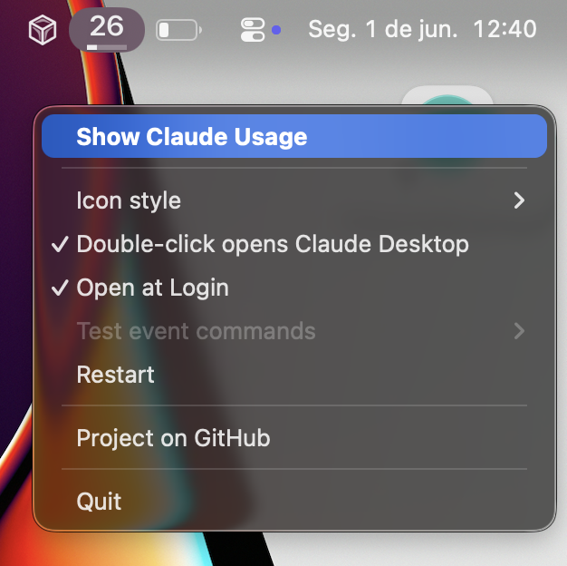

# Usage Monitor for Claude - cross-platform fork (Windows + macOS)

> **This is a personal fork of [`jens-duttke/usage-monitor-for-claude`](https://github.com/jens-duttke/usage-monitor-for-claude).**
> All credit for the original app goes to [@jens-duttke](https://github.com/jens-duttke). The original is Windows-only; this fork adds a macOS port (Apple Silicon) plus a few opt-in extras on both platforms, while keeping the original's security promises and APIs unchanged. Each release ships the Windows portable EXE and the macOS app - both built from this one source tree (the EXE via a public GitHub Actions workflow).
>
> **AI assistance disclosure.** The macOS port (code, build configuration, and the macOS-specific test suite) was developed in collaboration with Claude (Anthropic), with every change reviewed and tested by the fork maintainer before publishing. Commits authored against the fork carry an `Assisted-by: Claude (Anthropic)` trailer.

[](https://github.com/jens-duttke/usage-monitor-for-claude/discussions/categories/ideas)
[](https://github.com/sponsors/jens-duttke)

**Monitor your Claude rate limits in real time - from your Windows system tray or your macOS menu bar.**

A native tray/menu bar app that shows your Claude usage at a glance - lightweight, portable, and fully auditable. Rate limits are shared across claude.ai, Claude Code, Claude Code Cowork, and IDE extensions for VS Code and JetBrains - always know how much of your session and weekly limits (Sonnet, Opus, Fable, Cowork, and any future quota types) you have left.


> [!TIP]
> **Companion tool: [Agent Monitor for Claude](https://github.com/jens-duttke/agent-monitor-for-claude)**
>
> Usage Monitor for Claude tells you *how much* of your rate limits you have left. Its companion tool, [**Agent Monitor for Claude**](https://github.com/jens-duttke/agent-monitor-for-claude), tells you *what your agents are actually doing* - a live overview of every running Claude Code agent across all your projects: which ones are working, waiting for your input, blocked, finished, or errored, refreshed every few seconds. Agents are grouped by project with the ones that need attention floated to the top, each with its estimated cost, token breakdown, model, and host - and one click brings any agent's window to the foreground. If you run more than one agent at a time, it turns "which window was that again?" into a glance at the tray.
>
> You can even [launch it with a double-click on the tray icon](docs/event-commands.md#launch-agent-monitor-for-claude-on-double-click).

## What this fork adds

Relative to upstream, this fork adds a macOS port, a popup refresh button, an Icon Style toggle, a double-click-opens-Claude toggle, a Language submenu, a "Log in to Claude Code" menu shortcut, a "Show Fable usage separately" toggle for credit-based models, and a custom app icon. Prefer the pristine Windows original? Use the upstream release.

- **Native macOS menu bar app** (`UsageMonitorForClaude.app`, ~32 MB, Apple Silicon onedir bundle). Same auditability guarantees as upstream: credentials read from the system **Keychain** (never cached on disk), single network destination (`api.anthropic.com`), no file writes outside a small PID lock, your saved UI preferences, and the optional LaunchAgent plist (none holding your token or usage data).
- **Menu bar icon** rendered with SF Pro Semibold at 2x status-bar thickness and marked as an AppKit template image, so it adapts automatically to light/dark menu bars at retina density.
- **Click behavior**: left single-click opens the usage popup, left double-click opens Claude Desktop (via `claude://`, falling back to the `com.anthropic.claudefordesktop` bundle ID, then to `claude.ai` in the default browser), right-click or Ctrl+click shows the context menu.
- **Popup hosted in a native `NSPanel` + `WKWebView`** (no pywebview Cocoa backend), so AppKit's `NSApplication.run()` is owned cleanly by pystray. The upstream `popup.html`/`popup.css`/`popup.js` are reused unchanged - a small `WKUserScript` shims `window.pywebview.api.{close, open_url, refresh, report_height}` onto a `WKScriptMessageHandler`.
- **Autostart via LaunchAgent** (`~/Library/LaunchAgents/com.usage-monitor-for-claude.plist`) when "Start at login" is toggled. The plist self-heals if the `.app` is moved to a new location.
- **POSIX single-instance guard** using `flock` on `~/.usage-monitor-for-claude.lock` (a small file containing only PID + app version - no credentials).



See [`MAC_PORT.md`](MAC_PORT.md) for the full per-module list of macOS divergences, the network/filesystem audit performed before release, and build details.

## Features

- **Portable** - single executable, no installation, no Electron, no runtime required (Windows EXE ~12.5 MB; macOS `.app` ~32 MB onedir bundle). Download, place anywhere, run. To uninstall, drag it away
- **Zero configuration** - authenticates through your existing Claude Code login, no API key or manual token entry needed
- **Live tray / menu bar icon** with two [configurable](docs/configuration.md#tray-icon-bars) progress bars (session + weekly by default), [configurable tooltip](docs/configuration.md#tooltip-fields), percentage display, and theme-aware colors for light and dark backgrounds
- **Detail popup** (left-click) showing account info, dynamically detected usage bars for all active quota types (Session, Weekly, Sonnet, Opus, Fable, Cowork, and any new quotas Anthropic adds) with [configurable field selection](docs/configuration.md#popup-fields), extra usage, reset countdowns, a stale-data indicator when values may be outdated, and a refresh button to force an immediate update on demand; pin it open and move it while pinned (Windows) to keep usage details visible during long sessions, and [configure a compact pinned view](docs/configuration.md#compact-pinned-view) that hides the sections and bars you do not need. Reset times follow your system's 24-hour or 12-hour clock format automatically
- **Claude Code versions** - the popup shows which version is installed in each environment (native CLI, VS Code, Cursor, Windsurf), making it easy to spot when your IDE extension is ahead of or behind the CLI. Run Claude Code somewhere the app cannot see it, such as WSL? Add it with the [`cli_command`](docs/configuration.md#claude-cli-command) setting and its version is listed alongside the rest
- **Smart alerts** - configurable threshold notifications per quota type, with time-aware mode that only alerts when usage outpaces elapsed time. Reset notifications when a nearly exhausted quota refills
- **[Event commands](docs/event-commands.md)** - run a custom shell command when a quota resets, a usage threshold is crossed, the app starts up, or you double-click the tray icon. Send push notifications to your phone, resume an AI agent, start a fresh 5-hour session automatically, play an alert sound, launch a companion tool like [Agent Monitor for Claude](https://github.com/jens-duttke/agent-monitor-for-claude) on double-click, or trigger any custom workflow
- **Time marker** on each bar showing elapsed time in the current period - in the detail popup and on the tray icon bars - so you can instantly see whether your usage is ahead of or behind the clock; bars that outpace the clock turn red, in the popup and tray alike
- **Automatic token refresh** - when the OAuth session expires, runs `claude update` in the background to renew the token without user intervention. If a CLI update is installed, shows a notification (which you can turn off via the `notify_claude_update` setting)
- **Adaptive polling** - speeds up during active usage, pauses when the computer is idle or locked, aligns to imminent quota resets, and backs off on rate-limit errors. Switching your Claude account refreshes the tray immediately, so it never lingers on the previous account's usage
- **Multi-account** - monitor several Claude accounts side by side: launch one instance per account with `--config-dir="<path>"` pointing at each account's Claude config directory. Each tray icon shows its account's usage, with a `[dir-name]` tooltip prefix, per-instance settings, and its own autostart entry
- **13 languages** (English, German, French, Spanish, Portuguese, Italian, Japanese, Korean, Hindi, Indonesian, Chinese Simplified, Chinese Traditional, Ukrainian) - auto-detected from your system language, with optional manual override via the `language` setting
- **[Customizable](docs/configuration.md)** - optionally override polling intervals, colors, alert thresholds, and more via a JSON settings file

---

## Security & Transparency

This tool handles your Claude Code OAuth token, so you should be able to verify it is safe. The codebase is deliberately structured for easy auditing:

- **Single network destination** - communicates exclusively with `api.anthropic.com`, no other hosts
- **Credentials stay local** - the OAuth token is used only in HTTP Authorization headers, never logged, stored elsewhere, or transmitted to third parties. On Windows the token is read from `~/.claude/.credentials.json`; on macOS it is read from the system Keychain. Either way it is cached in memory only.
- **No usage data, credentials, or telemetry written to disk.** The macOS port writes a small single-instance lock at `~/.usage-monitor-for-claude.lock` (PID + app version), your Icon Style and double-click preferences at `~/Library/Preferences/com.usage-monitor-for-claude.settings.plist`, and, only when "Start at login" is enabled, a LaunchAgent plist at `~/Library/LaunchAgents/com.usage-monitor-for-claude.plist`. None of them contains your token or any usage data. The Windows build is unchanged from upstream.
- **No dynamic code execution** - no `eval()`, `exec()`, `compile()`, or dynamic imports
- **No obfuscation** - no encoded strings, no hidden URLs, no minified logic
- **Modular architecture** - small, focused modules with security-critical code (credentials, API calls) isolated in a single file ([`api.py`](usage_monitor_for_claude/api.py))
- **Minimal runtime dependencies** - only four well-known packages: [requests](https://pypi.org/project/requests/), [Pillow](https://pypi.org/project/pillow/), [pystray](https://pypi.org/project/pystray/), [pywebview](https://pypi.org/project/pywebview/)

---

## Requirements

- **macOS 11 (Big Sur) or later, on Apple Silicon** for the `.app` release of this fork. The build is `target_arch='arm64'`; switch to `universal2` in the spec if Intel Mac support is needed.
- **Windows 10 or Windows 11** (64-bit) is also supported by the same source tree (the fork preserves all Windows code paths), and every release here ships a pre-built, CI-built `UsageMonitorForClaude.exe`.
- **[Claude Code](https://docs.anthropic.com/en/docs/claude-code)** installed and logged in (CLI, VS Code extension, or JetBrains plugin - any variant works). On Windows the app reads the OAuth token from `~/.claude/.credentials.json`; on macOS it reads from the system **Keychain** via `/usr/bin/security find-generic-password` (no file cache). If you have `CLAUDE_CONFIG_DIR` set, the Windows path honors it, and the `--config-dir="<path>"` command-line parameter overrides both - useful to run one instance per Claude account (log each extra account in via Claude Code with `CLAUDE_CONFIG_DIR` pointing to its own directory first).

> [!TIP]
> If the token expires, the app automatically runs `claude update` to refresh it. If the token is missing entirely, the app shows a notification and a "!" icon - log in to Claude Code and the monitor picks it up automatically.

---

## Quick Start

### macOS (this fork)

**No Python required.** Download the latest **`UsageMonitorForClaude.app.zip`** from this fork's [Releases](https://github.com/lawyerplayingaround/usage-monitor-for-claude-mac/releases/latest), unzip it (Safari unzips automatically; in other browsers double-click the `.zip`), drag the `UsageMonitorForClaude.app` into `/Applications` (or anywhere you prefer), and launch it. The icon appears in the menu bar.

> [!NOTE]
> The `.app` is **unsigned and unnotarized**. On first launch macOS Gatekeeper will refuse to open it - **open it once to get the refusal dialog, then System Settings > Privacy & Security > "Open Anyway", relaunch, and confirm. Subsequent launches work normally. Signing/notarization would require Apple Developer enrollment, which is out of scope for this fork.

To remove: turn off "Start at login" from the menu bar context menu first (if enabled - this deletes `~/Library/LaunchAgents/com.usage-monitor-for-claude.plist`), then drag the `.app` to the Trash.

### Windows

**No Python required.** Download the latest [**UsageMonitorForClaude.exe**](https://github.com/lawyerplayingaround/usage-monitor-for-claude-mac/releases/latest) from this fork's releases (CI-built from the tagged source), place it wherever you like, and run it. To remove, disable "Start with Windows" in the context menu first (if enabled), then delete the file.

---

## How to Use

| Action | What happens |
|---|---|
| **Hover** over the tray icon | Tooltip shows 5h and 7d usage percentages with reset times |
| **Left-click** the tray icon | Opens the detail popup with account info and all usage bars |
| **Double-click** the tray icon | Runs the [`on_double_click_command`](docs/event-commands.md) if configured (e.g. launch [Agent Monitor for Claude](https://github.com/jens-duttke/agent-monitor-for-claude)); otherwise does nothing |
| **Right-click** the tray icon | Context menu: open popup, autostart toggle, test event commands, restart, GitHub link, or quit |
| **Escape** or click outside | Closes the detail popup |

### Tray / menu bar icon not visible?

**Windows.** Windows may hide new tray icons by default. To keep the icon always visible:

1. Right-click the **taskbar** → **Taskbar settings**
2. Expand **Other system tray icons** (Win 11) or **Select which icons appear on the taskbar** (Win 10)
3. Toggle **UsageMonitorForClaude** to **On**

**macOS.** Menu bar items are shown by default, but if the menu bar is crowded the system may push items off-screen. Hold **Cmd** and drag the icon to reorder it closer to the leading edge, or use a menu-bar manager (Bartender, iceberg, etc.) to control visibility.

### Reading the progress bars

Each bar in the detail popup has up to four visual elements:

1. **Blue fill** - how much of the limit you have used
2. **Time dividers** - subtle gaps splitting the session bar into equal hour sections and marking local midnights on the weekly bars, visually grouping usage into hour and day segments
3. **White vertical line** - how much *time* has passed in the current period. The fill turns **red** when it passes this marker, warning that you may hit the limit before the period resets.
4. **Reset text** - when the limit resets, shown as a countdown with clock time

---

## Configuration

All settings work out of the box - no configuration file is needed. To customize behavior, create a file called `usage-monitor-settings.json` with only the keys you want to change:

```json
{
  "poll_interval": 180,
  "bar_fg": "#00cc66",
  "bar_fg_warn": "#ff6600"
}
```

The app searches for this file in these locations (first match wins):

1. **`$CLAUDE_CONFIG_DIR/usage-monitor-settings.json`** (when a custom config directory is set via `--config-dir` or `CLAUDE_CONFIG_DIR`) - so each instance can have its own settings
2. **Next to the EXE** (or project root when running from source)
3. **`~/.claude/usage-monitor-settings.json`**

The app never creates or modifies this file. See [Configuration](docs/configuration.md) for all available settings (alert thresholds, polling intervals, colors, language, and more).

---

## Building from Source

<details>
<summary>For developers who want to build the EXE themselves</summary>

### Prerequisites

- Python 3.10+
- pip

### Setup (Windows)

```bash
git clone https://github.com/lawyerplayingaround/usage-monitor-for-claude-mac.git
cd usage-monitor-for-claude-mac
python -m venv .venv
.venv\Scripts\activate
pip install -r requirements.txt
```

### Setup (macOS)

```bash
git clone https://github.com/lawyerplayingaround/usage-monitor-for-claude-mac.git
cd usage-monitor-for-claude-mac
python3 -m venv .venv
source .venv/bin/activate
pip install requests Pillow pystray pywebview \
    pyobjc-core pyobjc-framework-Cocoa pyobjc-framework-Quartz pyobjc-framework-WebKit \
    pyinstaller
```

### Run

```bash
python -m usage_monitor_for_claude       # Windows
python3 -m usage_monitor_for_claude      # macOS
```

### Build

```bash
python build.py        # Windows: dist/UsageMonitorForClaude.exe (~12.5 MB)
python3 build.py       # macOS:   dist/UsageMonitorForClaude.app (~32 MB, arm64 onedir)
```

The same `build.py` and `usage_monitor_for_claude.spec` produce the appropriate artifact for the host platform; the spec branches on `sys.platform`.

### Popup UI Development

The popup UI lives in [`usage_monitor_for_claude/popup/`](usage_monitor_for_claude/popup/) as separate HTML, CSS, and JS files. To preview and iterate on the UI without running the full app:

```bash
start http://localhost:8080/usage_monitor_for_claude/popup/dev.html && python -m http.server 8080
```

This starts a local server and opens the dev preview in your default browser. Use the buttons to switch between data presets (full, minimal, error, loading) and the language dropdown to preview every locale (so you can spot strings that overflow the popup width). Test CSS/JS changes with instant feedback.

### Create a Release

1. Update dependencies: `pip install --upgrade -r requirements.txt`
2. Update `__version__` in [`usage_monitor_for_claude/__init__.py`](usage_monitor_for_claude/__init__.py) and the version in [`version_info.py`](version_info.py) (`filevers`, `prodvers`, `FileVersion`, `ProductVersion`). The macOS `.app` reads `CFBundleShortVersionString` from `__init__.py` automatically via the spec.
3. Update `_FALLBACK_USER_AGENT` in [`usage_monitor_for_claude/api.py`](usage_monitor_for_claude/api.py) to the current Claude Code version
4. In [`CHANGELOG.md`](CHANGELOG.md), rename `## [Unreleased]` to `## [x.y.z-fork.N] - YYYY-MM-DD` and add a fresh empty `## [Unreleased]` section above it
5. Run the test suite: `python -m unittest discover -s tests` (macOS will skip Win32-only modules - that is expected)
6. Smoke test: run from source and verify the icon, popup, and settings on the host platform
7. Build the artifact (`python build.py`) and smoke-test it
8. Stage the changes from steps 2 to 4
9. Commit, tag, push, and publish (example for a macOS release of this fork):

   ```bash
   git commit -m "Release v1.x.x-fork.N"
   git tag v1.x.x-fork.N
   git push origin main v1.x.x-fork.N
   # Use --repo to make sure gh targets the fork and not upstream
   gh release create v1.x.x-fork.N \
     --repo lawyerplayingaround/usage-monitor-for-claude-mac \
     dist/UsageMonitorForClaude.app \
     --title "v1.x.x-fork.N" \
     --notes "<release notes from CHANGELOG.md>"
   ```

</details>

---

## Contributing

Contributions are welcome - whether it's bug reports, feature ideas, or pull requests. [Open an issue](https://github.com/jens-duttke/usage-monitor-for-claude/issues) to report bugs or ask questions. For feature ideas, browse and vote on existing proposals or submit your own in [Ideas](https://github.com/jens-duttke/usage-monitor-for-claude/discussions/categories/ideas).

<details>
<summary>For developers who want to contribute to the project</summary>

This project is developed with [Claude Code](https://docs.anthropic.com/en/docs/claude-code). The [`.claude/CLAUDE.md`](.claude/CLAUDE.md) file contains all project conventions, coding standards, and architectural guidelines - Claude Code applies these automatically during development.

### Workflow

1. Read `.claude/CLAUDE.md` to understand the project conventions
2. Implement your changes with Claude Code - it will follow the guidelines automatically
3. Before committing, run the `/review` slash command to perform a systematic quality review of all staged changes (code, tests, documentation)
4. Stage remaining fixes if any, then run `/commit-message` to generate a properly formatted commit message

### Adding features

New features should follow the existing architecture. Key points from the guidelines:

- Security-critical code (credentials, API calls) stays isolated in [`api.py`](usage_monitor_for_claude/api.py)
- All user-facing changes need updates in [`CHANGELOG.md`](CHANGELOG.md), [`README.md`](README.md), and [`docs/configuration.md`](docs/configuration.md) where applicable
- Tests are required - run `python -m unittest discover -s tests` before committing
- The app never writes usage data, credentials, or telemetry to disk; the only writes are the single-instance lock, the UI-preferences store (Icon Style / double-click choices), and the optional macOS autostart plist (none contains a token or usage data)

</details>

---

## License

MIT

---

## Disclaimer

This is an independent, community-built project. It is **not** created, endorsed, or officially supported by [Anthropic](https://www.anthropic.com/). "Claude" and "Anthropic" are trademarks of Anthropic, PBC. Use of these names is solely for descriptive purposes to indicate compatibility.
