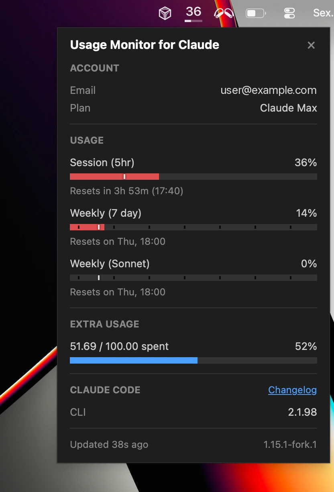

# Usage Monitor for Claude

**Monitor your Claude rate limits in real time — right from your Windows system tray.**

Usage Monitor for Claude is a lightweight desktop tool that shows your current Claude usage as a live system tray icon. Rate limits are shared across claude.ai, Claude Code, and IDE extensions like the VS Code or JetBrains plugin — always know how much of your session and weekly limits you have left.



## Features

- **Portable** - single EXE, no installation required. Just download, place anywhere, and run
- **Autostart** - optional "Start with Windows" toggle in the right-click menu
- **Live tray icon** - displays a "C" during normal use, switches to the current percentage when session usage exceeds 50%, and shows "✕" when you hit the rate limit
- **Two progress bars** in the icon: top bar = 5-hour session limit, bottom bar = 7-day weekly limit
- **Hover tooltip** with a quick summary of your 5-hour and 7-day usage, including reset times
- **Detail popup** (left-click) - dark-themed window showing your account info (email, plan), separate usage bars for Session, Weekly, Weekly Sonnet, and Weekly Opus limits, an extra usage section when enabled on your account, and a status line showing data freshness
- **Time marker** - a white vertical line on each bar shows how much time has passed in the current period, so you can tell whether usage is ahead of or behind the clock
- **Color warning** - bars turn red once usage reaches 80%
- **Usage alerts** - optional Windows notifications when usage exceeds configurable thresholds (e.g., 80%, 95%), independently configurable per quota type. Time-aware mode (on by default) suppresses alerts when usage is on track with elapsed time, with a configurable cutoff so high thresholds always fire
- **Reset notification** - get a Windows notification when your session (>95%) or weekly (>98%) quota resets after being nearly exhausted
- **Reset countdown** below each bar, e.g. "Resets in 2h 20m (14:30)"
- **Smart refresh** - updates every 2 minutes by default; automatically speeds up to 1-minute intervals while you are actively using Claude, then slows back down
- **Manual refresh** via right-click menu at any time
- **Multilingual UI** (English, German, French, Spanish, Portuguese, Italian, Japanese, Korean, Hindi, Indonesian, Chinese Simplified, Chinese Traditional) - automatically selected based on your Windows display language
- **Zero configuration** - authenticates through your existing Claude Code login
- **Customizable** - optionally override polling intervals, colors, and more via a [JSON settings file](#configuration)

---

## Security & Transparency

This tool handles your Claude Code OAuth token, so you should be able to verify it is safe. The codebase is deliberately structured for easy auditing:

- **Single network destination** - communicates exclusively with `api.anthropic.com`, no other hosts
- **Credentials stay local** - the OAuth token is used only in HTTP Authorization headers, never logged, stored elsewhere, or transmitted to third parties
- **Read-only** - the app never writes files to disk
- **No dynamic code execution** - no `eval()`, `exec()`, `compile()`, or dynamic imports
- **No obfuscation** - no encoded strings, no hidden URLs, no minified logic
- **Modular architecture** - small, focused modules with security-critical code (credentials, API calls) isolated in a single file ([`api.py`](usage_monitor_for_claude/api.py))
- **Minimal runtime dependencies** - only three well-known packages: [requests](https://pypi.org/project/requests/), [Pillow](https://pypi.org/project/pillow/), [pystray](https://pypi.org/project/pystray/)

---

## Requirements

- **Windows 10 or Windows 11** (64-bit)
- **[Claude Code](https://docs.anthropic.com/en/docs/claude-code)** installed and logged in (CLI, VS Code extension, or JetBrains plugin - any variant works). The app reads the OAuth token that Claude Code stores locally (`~/.claude/.credentials.json`). No API key, no manual token entry.

> [!TIP]
> If the token is missing or expired, the app shows a notification and a "!" icon. Simply log in to Claude Code again and the monitor picks it up automatically.

---

## Quick Start

**No Python required.** Download the latest [**UsageMonitorForClaude.exe**](https://github.com/jens-duttke/usage-monitor-for-claude/releases/latest), place it wherever you like, and run it. To remove, disable "Start with Windows" in the context menu first (if enabled), then delete the file.

---

## How to Use

| Action | What happens |
|---|---|
| **Hover** over the tray icon | Tooltip shows 5h and 7d usage percentages with reset times |
| **Left-click** the tray icon | Opens the detail popup with account info and all usage bars |
| **Right-click** the tray icon | Context menu: open popup, refresh now, autostart toggle, or quit |
| **Escape** or click outside | Closes the detail popup |

### Tray icon not visible?

Windows may hide new tray icons by default. To keep the icon always visible:

1. Right-click the **taskbar** → **Taskbar settings**
2. Expand **Other system tray icons** (Win 11) or **Select which icons appear on the taskbar** (Win 10)
3. Toggle **UsageMonitorForClaude** to **On**

### Reading the progress bars

Each bar in the detail popup has up to three visual elements:

1. **Blue fill** - how much of the limit you have used (turns **red** at 80%+)
2. **White vertical line** - how much *time* has passed in the current period. If the blue fill is to the left of this line, you are using Claude slower than the rate limit refills. If it is to the right, you are on track to hit the limit before the period resets.
3. **Reset text** - when the limit resets, shown as a countdown with clock time

---

## Configuration

All settings work out of the box — no configuration file is needed. To customize behavior, create a file called `usage-monitor-settings.json` with only the keys you want to change:

```json
{
  "poll_interval": 180,
  "bar_fg": "#00cc66",
  "bar_fg_high": "#ff6600"
}
```

The app searches for this file in two locations (first match wins):

1. **Next to the EXE** (or project root when running from source)
2. **`~/.claude/usage-monitor-settings.json`**

The app never creates or modifies this file. To start, create an empty file and add keys as needed.

<details>
<summary>Available settings</summary>

### Polling intervals

| Key | Default | Description |
|-----|---------|-------------|
| `poll_interval` | `120` | Seconds between API updates |
| `poll_fast` | `60` | Seconds when usage is actively increasing |
| `poll_fast_extra` | `2` | Extra fast polls after usage stops increasing |
| `poll_error` | `30` | Seconds after a failed request |

### Popup colors

| Key | Default | Description |
|-----|---------|-------------|
| `bg` | `"#1e1e1e"` | Background |
| `fg` | `"#cccccc"` | Text |
| `fg_dim` | `"#888888"` | Dimmed text (labels, reset times) |
| `fg_heading` | `"#ffffff"` | Section headings |
| `bar_bg` | `"#333333"` | Progress bar background |
| `bar_fg` | `"#4a9eff"` | Progress bar fill |
| `bar_fg_high` | `"#e05050"` | Progress bar fill when usage ≥ 80% |

### Alert thresholds

Configure usage percentage thresholds that trigger Windows notifications. Session and weekly quotas have separate thresholds since their time horizons differ significantly. Set to an empty array `[]` to disable alerts for a specific quota type.

| Key | Default | Description |
|-----|---------|-------------|
| `alert_thresholds_five_hour` | `[50, 80, 95]` | Thresholds for Session (5hr) |
| `alert_thresholds_seven_day` | `[95]` | Thresholds for all Weekly quotas (7 day, Sonnet, Opus) |
| `alert_time_aware` | `true` | Only alert when usage outpaces elapsed time |
| `alert_time_aware_below` | `90` | Time-aware check applies only to thresholds below this value; thresholds at or above always fire |

### Tray icon colors

Override individual channels as RGBA arrays `[R, G, B, A]` (0–255). Unspecified keys keep their defaults.

| Key | Default | Description |
|-----|---------|-------------|
| `icon_light` | `{"fg": [255,255,255,255], "fg_half": [255,255,255,80], "fg_dim": [255,255,255,140]}` | Light icons for dark taskbar |
| `icon_dark` | `{"fg": [0,0,0,255], "fg_half": [0,0,0,80], "fg_dim": [0,0,0,140]}` | Dark icons for light taskbar |

### Currency

The Anthropic API does not include currency information, so the app detects the currency symbol from your Windows locale settings. If your Windows locale currency differs from the currency Anthropic bills you in, you can override just the symbol here. Number formatting (decimal separator, symbol position) always follows your system locale.

| Key | Default | Description |
|-----|---------|-------------|
| `currency_symbol` | *(auto-detected)* | Override the auto-detected currency symbol (e.g., `"$"`, `"€"`, `"¥"`) |

</details>

---

## Building from Source

<details>
<summary>For developers who want to build the EXE themselves</summary>

### Prerequisites

- Python 3.10+
- pip

### Setup

```bash
git clone https://github.com/jens-duttke/usage-monitor-for-claude.git
cd usage-monitor-for-claude
python -m venv .venv
.venv\Scripts\activate
pip install -r requirements.txt
```

### Run

```bash
python -m usage_monitor_for_claude
```

### Build EXE

```bash
python build.py
```

Produces `dist/UsageMonitorForClaude.exe` (~20 MB), a single-file executable that bundles Python and all dependencies.

### Create a Release

1. Update dependencies: `pip install --upgrade -r requirements.txt`
2. Update `__version__` in [`usage_monitor_for_claude/__init__.py`](usage_monitor_for_claude/__init__.py) and the version in [`version_info.py`](version_info.py) (`filevers`, `prodvers`, `FileVersion`, `ProductVersion`)
3. In [`CHANGELOG.md`](CHANGELOG.md), rename `## [Unreleased]` to `## [1.x.x] - YYYY-MM-DD` and add a fresh empty `## [Unreleased]` section above it
4. Run the test suite: `python -m unittest discover -s tests`
5. Manual smoke test: `python -m usage_monitor_for_claude` — verify tray icon, popup, and settings
6. Build the EXE with `python build.py`
7. Commit, tag, push, and publish:

   ```bash
   git add -A && git commit -m "Release v1.x.x"
   git tag v1.x.x
   git push origin main v1.x.x
   gh release create v1.x.x dist/UsageMonitorForClaude.exe --title "v1.x.x" --notes "<release notes from CHANGELOG.md>"
   ```

</details>

---

## License

MIT

---

## Disclaimer

This is an independent, community-built project. It is **not** created, endorsed, or officially supported by [Anthropic](https://www.anthropic.com/). "Claude" and "Anthropic" are trademarks of Anthropic, PBC. Use of these names is solely for descriptive purposes to indicate compatibility.
